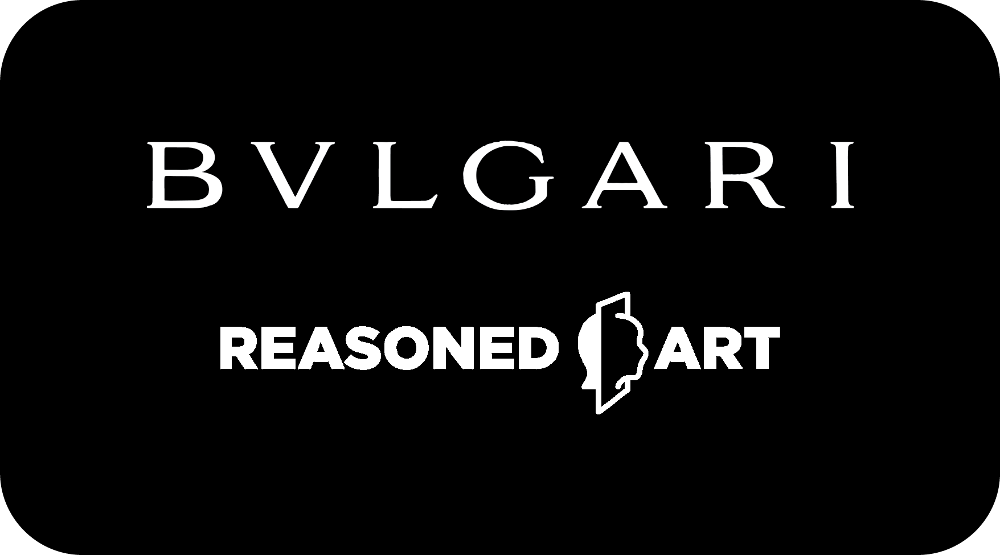

<h1 align='center'>Bulgari Gift Smartcontract</h1>

Mints Limited Edition of a Digital Artwork as Non-Transferable NFTs. Each minted token represents a gift for a guest invited to a physical event. The contract:
* only allows contract owner to mint new tokens
* mints no more than one token for the same guest
* mints no more tokens than the amount of invited guests
* allows to forever end minting before reaching the number of invited guests (some guests may not claim it)
* tokens aren't burnable

## Why Non-Transferable NFTs
The ownership of this token is (a) a public statement about the holder, is (b) a set of rights over the digital artwork it encapsulates, and (c) must serve no lucrative purposes. Standards such as `ERC-721` or `ERC-1155` are too complex for the use-case and require disabling some of their core functionalities. This Smartcontract leverages ideas from the `ERC-1238` [standard discussion](https://github.com/ethereum/EIPs/issues/1238), can be improved in multiple ways, and poses itself as the first of a series of experimentations.

## Usage

### Environment Variables

### Testing
```
# Clone repository
git clone https://github.com/reasonedart/bulgari-gift-contract.git

# Go into the repository
cd bulgar-gift-contract

# Install dependencies
yarn install

# Compile Smartcontract
npx hardhat compile

# Test Smartcontract
npx hardhat test

```

### Deployment
```
# Deploy locally
npx hardhat run scripts/deploy.js

# OR, deploy on Polygon testnet
npx hardhat run scripts/deploy.js --network mumbai
```

### Minting